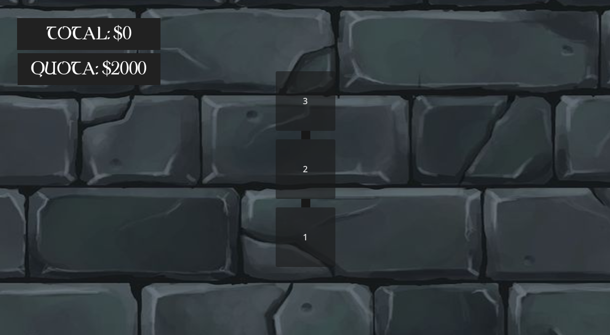
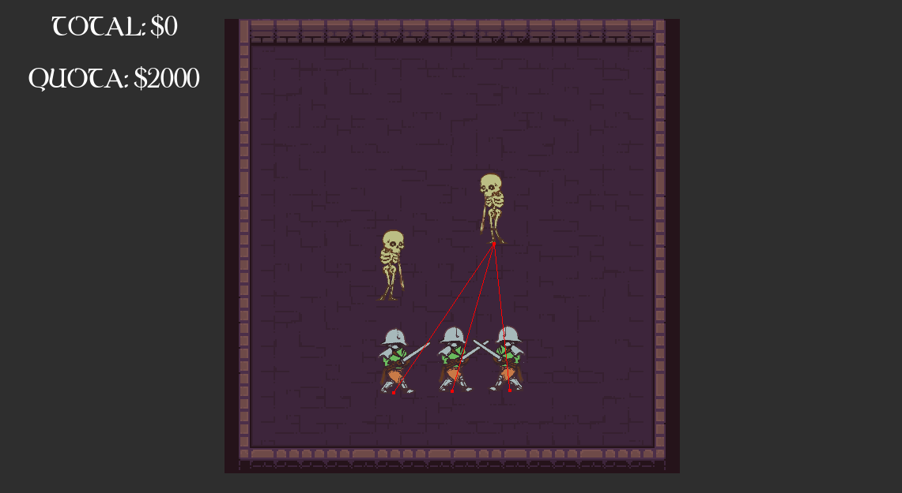
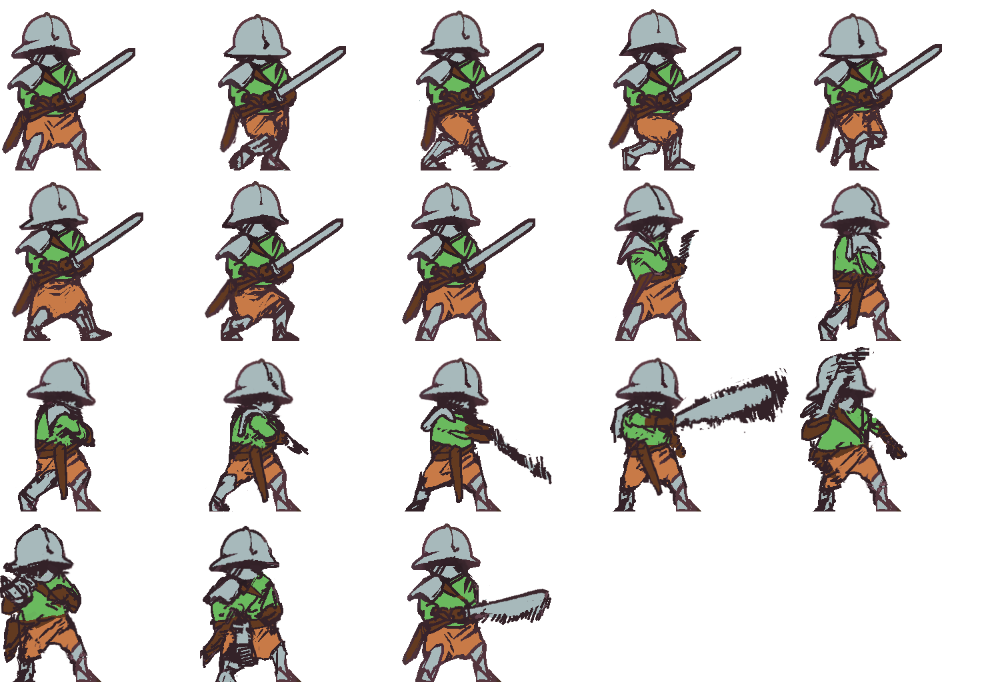
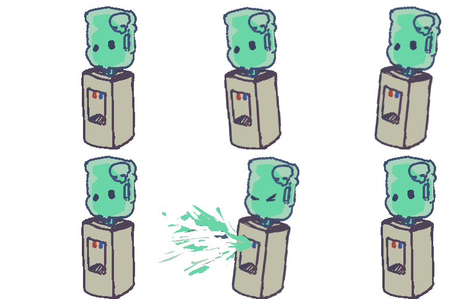
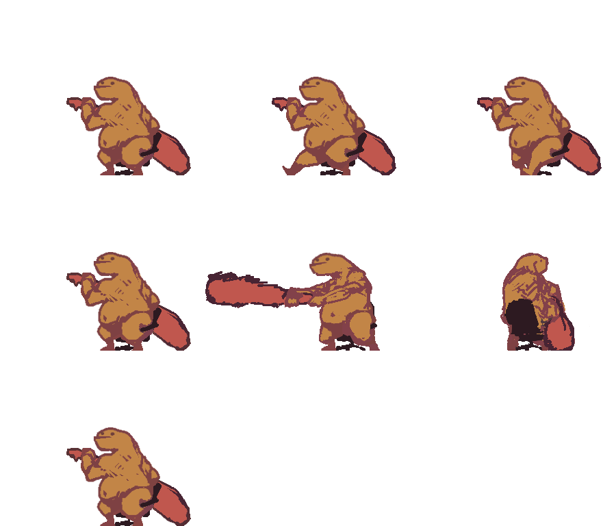

# Department of Dungeon Design #

## Summary ##

It’s another beautiful day of work at the Department of Dungeon Design! It’s always been your dream to work as a dungeon master and after all these years you know it’s time: you deserve a raise. Set up your defenses, rally the monsters, prime the traps! Meet your quota by slaying adventurers with your dungeon design, and maybe you’ll get the promotion of your dreams! Your paycheck comes out of that treasure you’re guarding, so you better not let any pesky adventurers through.

## Project Resources

[Web-playable version of your game](https://lmukar.itch.io/department-of-dungeon-design)  
[Trailer](https://drive.google.com/file/d/1bx2WpOICYy6TbZIUmMJ08n9ODcFkNQXx/view?usp=sharing)   
[Press Kit](#press-kit-and-trailer)  
[Initial Plan](https://docs.google.com/document/d/1seP3CGc7eH109oYLATlTatLcgkJYDgn-x0SzhATfhZY/edit?usp=sharing)  

## Gameplay Explanation ##

### Dungeon Map

On the map screen, you can view the progression of rooms that the adventuring parties would travel through. Click on a room to view it and populate it with monsters.

### Dungeon Rooms

On each room screen, you can select a monster using the number keys:
1. Skeleton
2. Slime
3. Golem

Click anywhere in the room to place that monster down. Each monster costs a certain amount toward the room's total capacity. When you select a monster, you can view its cost and its range. When you're done designing a room, click on the "READY" button to activate the battle phase. You can also press shift to reopen the map.

#### Battle

Once you press "READY", the adventurers enter the room! You can watch your monsters fight the adventuring party, and see how much money you earn from the battle in real time.

**Add it here if you did work that should be factored into your grade but does not fit easily into the proscribed roles! Please include links to resources and descriptions of game-related material that does not fit into roles here.**

**FIXME**: include links and credits to background assets

# Roles #

Your goal is to relate the work of your role and sub-role in terms of the content of the course. Please look at the role sections below for specific instructions for each role.

Below is a template for you to highlight items of your work. These provide the evidence needed for your work to be evaluated. Try to have at least four such descriptions. They will be assessed on the quality of the underlying system and how they are linked to course content. 

*Short Description* - Long description of your work item that includes how it is relevant to topics discussed in class. [link to evidence in your repository](https://github.com/dr-jam/ECS189L/edit/project-description/ProjectDocumentTemplate.md)

Here is an example:  
*Procedural Terrain* - The game's background consists of procedurally generated terrain produced with Perlin noise. The game can modify this terrain at run-time via a call to its script methods. The intent is to allow the player to modify the terrain. This system is based on the component design pattern and the procedural content generation portions of the course. [The PCG terrain generation script](https://github.com/dr-jam/CameraControlExercise/blob/513b927e87fc686fe627bf7d4ff6ff841cf34e9f/Obscura/Assets/Scripts/TerrainGenerator.cs#L6).

You should replay any **bold text** with your relevant information. Liberally use the template when necessary and appropriate.

## Ezren Aldas ##

### Producer

*Ideation* - Actively participated in initial game ideation, created sketches and worked with team to develop ideas

Above: Sketch thumbnails of play phases

Above: Sketches and notes of game screens

Above: Two ideation sketches of watercooler-themed slime monster sprites

*Initial Schedule* - Created rough schedule in initial plan

*Team meetings* - Scheduled team meetings over Discord to check progress, created [meeting notes](https://docs.google.com/document/d/1NNRejOOlFjJQT2Wy9uCQfDIvcaMyyb9y9IaMTauezOU/edit?usp=sharing), managed team progress

### Narrative Design

*Money System* - Developed money system and [moneyengine.md](./dungeon_dept/scripts/global/money_engine.gd), to act as scoring system incentivizing play that ties into corporate narrative

*Opening cutscene* - Implemented [opening cutscene](./dungeon_dept/scenes/cutscene.tscn) to give backstory and prologue to players, drew rough draft sketches and wrote narration

### Other Contributions

*Damage mechanics* - For each entity scene (knight, skeleton, slime, golem): Worked on take_damage functions (e.g. [func take_damage in knight.gd](https://github.com/twobles/ecs-179-project-dungeon-dept/blob/63dba52300e3ed61025ec35cca247d69ac9c2e10/dungeon_dept/scripts/adventurers/knight.gd#L25)), added and implemented DamageTaken label node for indicating amount of damage taken

## Ivan Hoang ##

### Animation and Visuals

Drew/Animated all of the character entity assets. I only managed to fully animate the Knight and Skeleton classes due to time, the other characters have temporary animation for now.

**Describe how your work intersects with game feel, graphic design, and world-building. Include your visual style guide if one exists.**

We spent a lot of time discussing the overall narrative and how it ties into the gameplay. Spent several meetings brainstorming ideas for the different character archetypes, their functions, behaviors, and visual designs. I tried to go along with the comedic office setting/narrative with monsters having office aspects like a Slime Water Dispenser and a Big Golem that relies on a office chair. Working close with the characters incentivized me to think on the interleaving gameplay as well.

### Game Feel and Polish

I worked on the fundamental game logic/coding. Worked on Behavior Tree AI logic, Pathfinding, Melee Attacking, Shooting Projectile mechanics. Since I was so involved with the characters, I really wanted to implement their behaviors and their overall presentation in the gameplay. I would have liked to have done more for character variety and iterations, but ran out of time getting the fundamental gameplay working and essential visuals.  

### Other Contributions

**Other contributions outside roles. Delete section if not applicable**

## Josh Lai ##

### User Interface and Input

**Describe your user interface and how it relates to gameplay. This can be done via the template.**

The start menu has an option to start the game. Once the start button is clicked, a cutscene-style slideshow is played where the user can click through the slides to progress through the cutscene. After, the user is taken to a map with 3 boxes where they have a choice of choosing one. In each room, there is a build menu UI where the user can place down a combination of 3 monsters. Utilizing the 1, 2, and 3 number keys, the respective monsters will be shown and by pressing the left mouse button, they will be placed down within the board area. The user can also choose to clear the monster chosen by pressing the backspace key. Once the user is finished placing down monster entities, they can click ready and the battle scene will begin. The user can also go through different rooms by clicking the shift key and selecting the room in the map.

**Describe the default input configuration.**

The default input configuration is keyboard and mouse. 

**Add an entry for each platform or input style your project supports.**

&nbsp;&nbsp;&nbsp;&nbsp;Left Mouse Button: Pressing all buttons and placing monsters down on the map

&nbsp;&nbsp;&nbsp;&nbsp;Number 1 Key: Choosing skeleton

&nbsp;&nbsp;&nbsp;&nbsp;Number 2 Key: Choosing slime

&nbsp;&nbsp;&nbsp;&nbsp;Number 3 Key: Choosing golem

&nbsp;&nbsp;&nbsp;&nbsp;Backspace Key: Clearing shown monster

&nbsp;&nbsp;&nbsp;&nbsp;Shift Key: Go back to the map

### Audio

**List your assets, including their sources and licenses.**

Audio Sources: 

Menu Soundtrack: Goblins_Den_(Regular).ogg by Leohpaz -- https://leohpaz.itch.io/minifantasy-dungeon-sfx-pack

Battle Soundtrack: Goblins_Dance_(Battle).ogg by Leohpaz -- https://leohpaz.itch.io/minifantasy-dungeon-sfx-pack

Clicking SFX: Click1B.ogg by EpeSami -- https://epesami.itch.io/mechanical-click-sound-pack

Skeleton SFX: Rattling Bones.wav by spookymodem -- https://freesound.org/s/202102/ -- License: Creative Commons 0

Slime SFX: Slosh A.wav by samuelcable -- https://freesound.org/s/393494/ -- License: Creative Commons 0

Golem SFX: Thump Slice.wav by johnnypanic -- https://freesound.org/s/320826/ -- License: Creative Commons 0

**Describe the implementation of your audio system.**

<u>Soundtrack:</u> Upon the project being ran, the menu soundtrack is being played on a loop. This continues when the user enters the room. When the user clicks ready in a room, the battle soundtrack will be played on a loop. However, when switching back to the map, the menu soundtrack is played again. This logic is applicable to every room in the map. 

<u>Sound Effects:</u> There is a clicking sound effect that is played whenever a button is clicked. In the Build Menu UI, sound effects are being played depending on which monster is being placed down for roughly one second. When the skeleton is placed down, a bone rattling sound effect plays. When the slime is placed down, a water sloshing sound effect plays. When the golem is placed down, a thumping sound effect plays.

**Document the sound style.** 

The style of the sound was aimed to represent adventurers invading a dungeon. Thus, we wanted to find a soundtrack that had dark undertones while still having an appropriate game soundtrack. The battle soundtrack involves a more jumpier beat that reflects the adventurers and monsters in battle. The sound effects of the monsters being placed down was intended to achieve an interactive connection with the user.

### Other Contributions

**Other contributions outside roles. Delete section if not applicable**

## Joe Zhu ##

### Movement/Physics

Attempted to improve pathfinding for the entities (monster and advanturers). Looked for ways to get the monsters surrounding the adventurers. Also attempted to fix the attack and damage system. Currently, monsters have friendly fire and both adventurers and monsters are taking damage without being attacked. Failed attempts are in the branches. Actively discussed with the team on the problems and solutions.

### Press Kit and Trailer

**Press Kit**

I choose to show case the game's narrative and the game's unique art style in the press kit. The press kit includes the game's assests such as side-notes and spirits and a brief description of the game. 

**Trailer**
[Trailer](https://drive.google.com/file/d/1bx2WpOICYy6TbZIUmMJ08n9ODcFkNQXx/view?usp=sharing)
In the trailer I wanted to make audiences feel the potential of the game. I included the game's narrative and the game's unique art style. I also included the clips of the gameplays with different combinations of monsters to show the game's variety.

### Other Contributions

## Huy Vuu ##

### Game Logic

**Build UI Logic**
 
I implemented the build UI logic that allows the user to place monsters. I used a factory design pattern to spawn the enemies. The enemies have their processes paused before the user presses start and only when the ready will the fight begin.

**Game Flow Logic**
 
I implemented the higher level management classes that track the existing entities and rooms. For example, the RoomManager uses a script to enable room visibility. 

**Rooms**
 
I built the scene tree for the rooms. Importantly each room has an EntityManager, BuildUI, and other UI.

I also provided assistance anywhere it was needed, helping with setting up the UI since that is closely related to the logic side.

### Gameplay Testing

Regretfully, I did not feel our progress was enough to perform full scale gameplay testing. The main feedback we receivied was during the game festival.

During the festival I was able to identify some bugs such as glitchy placement, incorrect cost deductions, etc and was able to use that to polish off some of the bugs.

